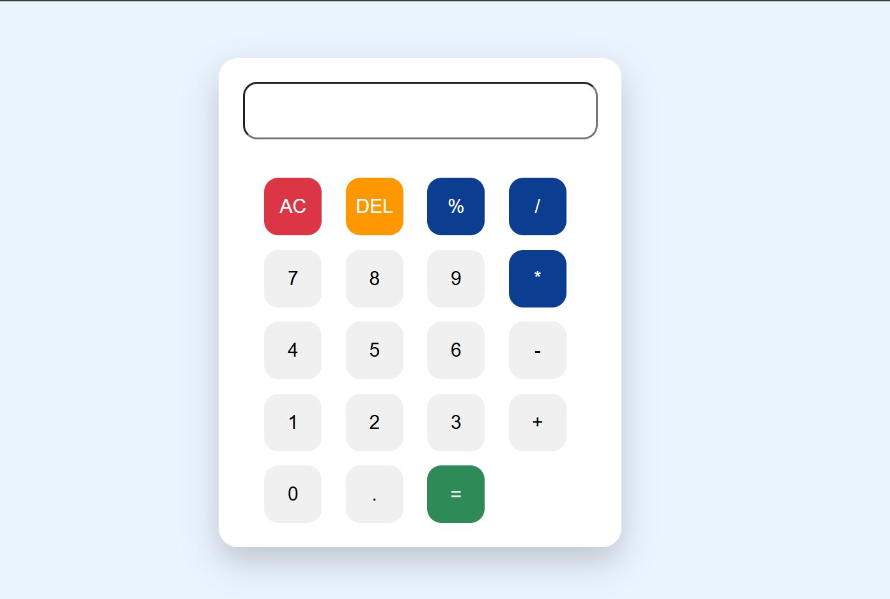

# 🧮 Calculator Web Application

A simple and responsive Calculator built using **HTML, CSS, and JavaScript** as **Task 2** of my **Oasis Infobyte Web Development & Designing Internship**.

---

## 🚀 Features

- ➕ Basic arithmetic operations
- 🧹 Clear (AC) button
- ⌫ Delete (DEL) button
- ➗ Supports %, +, -, ×, ÷ operations
- 🟢 Instant calculation using "="
- 🎨 Modern responsive UI
- ✨ Button hover and click animations

---

## 🛠️ Technologies Used

- HTML5
- CSS3
- JavaScript (Vanilla JS)

---

## 📸 


> Save a screenshot of your calculator as **calculator.png** inside your project's **images** folder.

---

## 📂 Project Structure

```
WebDev-L2-Calculator/
│── index.html
│── style.css
│── script.js
│── README.md
└── images/
    └── calculator.png
```

---

## 📖 What I Learned

- DOM Manipulation
- Event Listeners
- JavaScript Functions
- Conditional Statements (`if-else`)
- String Manipulation
- CSS Grid
- Flexbox
- Responsive UI Design

---

## 🎯 Internship

This project was developed as **Task 2** during my **Web Development & Designing Internship** at **Oasis Infobyte**.

---

## 👩‍💻 Author

**Bhumi Singh**

GitHub: https://github.com/Bhumi678

LinkedIn: https://www.linkedin.com/in/bhumi-singh-33605335a 