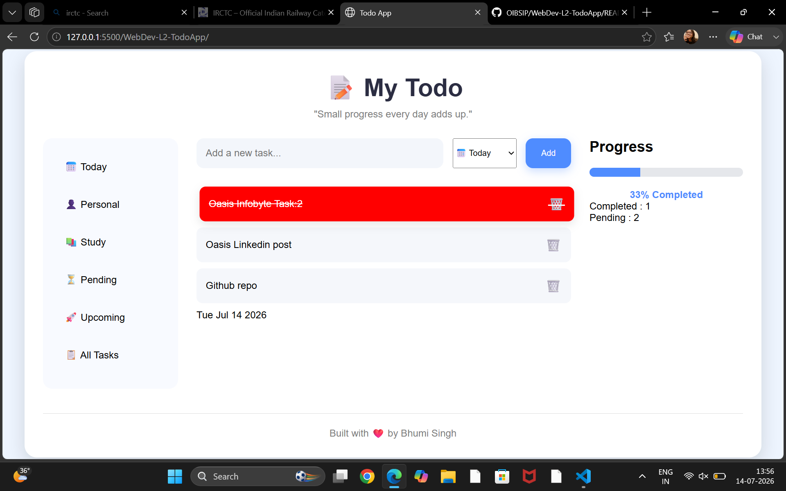
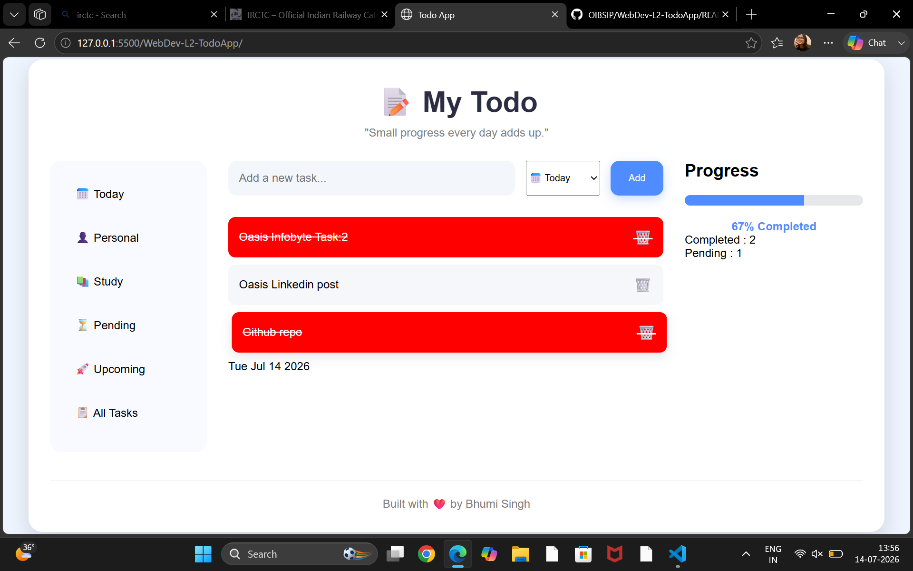
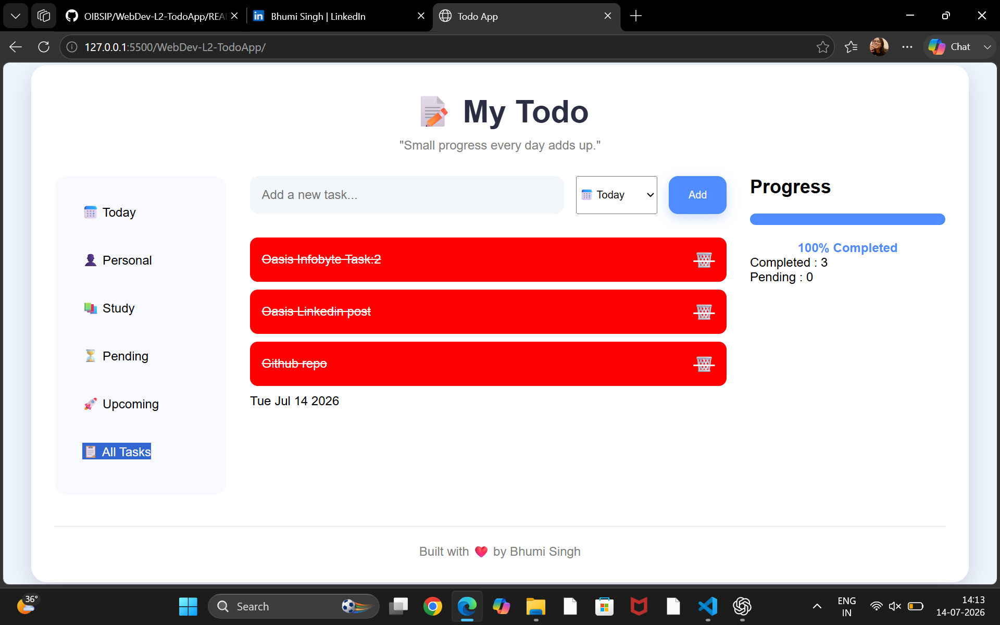

# 📝 My Todo App

A modern and responsive Todo App built using **HTML, CSS, and JavaScript**. This application helps users organize daily tasks, track progress, and save tasks even after refreshing the browser using Local Storage.

---

## ✨ Features

- ➕ Add new tasks
- 🗑️ Delete tasks
- ✅ Mark tasks as completed / uncompleted
- 💾 Save tasks using Local Storage
- 📊 Live Progress Bar
- 📈 Completed & Pending Task Counter
- ⌨️ Add tasks using the Enter key
- 🎉 Empty state message when no tasks are available
- 📅 Displays the current date
- 💬 Random motivational quote
- 🏷️ Task categories (Today, Personal, Study, Pending, Upcoming)
- 📂 Sidebar category filtering
- 📱 Clean and responsive user interface

---

## 🛠️ Built With

- HTML5
- CSS3
- JavaScript (ES6)
- Local Storage API

---

## 📸 Screenshots

### Home Page


Home
### Adding Tasks


### Completed Task



---

## 🚀 How to Run

1. Clone the repository

```bash
git clone https://github.com/YOUR_USERNAME/WebDev-L2-TodoApp.git
```

2. Open the project folder.

3. Open `index.html` in your browser.

---

## 📂 Project Structure

```
WebDev-L2-TodoApp
│
├── index.html
├── style.css
├── script.js
├── README.md
└── screenshots
    ├── home.png
    ├── tasks.png
    └── completed.png
```

---

## 🎯 Future Improvements

- Dark Mode
- Drag & Drop Tasks
- Due Dates & Reminders
- Search Tasks
- Edit Existing Tasks

---

## 👩‍💻 Author

**Bhumi Singh**

- GitHub: https://github.com/Bhumi678
- LinkedIn: https://www.linkedin.com/in/bhumi-singh-33605335a/

---

⭐ If you like this project, don't forget to star the repository!